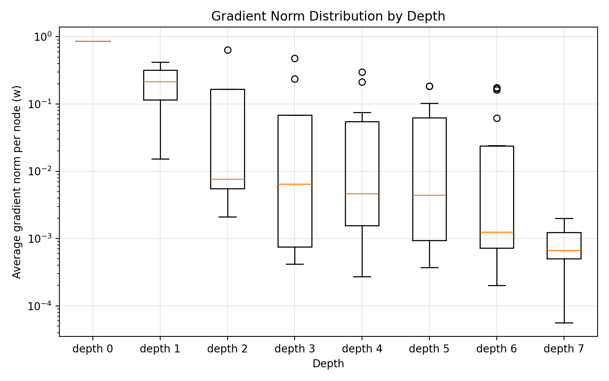

# 🌱 Vanishing Gradients in Soft Decision Trees

*A little gradient boost for deeper trees.*

This machine learning project explores vanishing gradients in soft decision trees and a simple remedy: scaling updates by `2^depth`. It compares ordinary and depth-scaled trees with a logistic regression baseline on a bike-sharing demand classification task.

📄 [Read the report](Soft%20Decision%20Tree_Ni_Degroot.pdf) · 🎨 [View the poster](SDT_Project_Poster_New.pdf)

## Grow a tree

```bash
python -m pip install -r requirements.txt
python run_bike_sharing.py
```

Run from the repository root. The script downloads the UCI Bike Sharing dataset, trains the models, and saves metrics and gradient plots to `outputs/`. An internet connection is needed to fetch the data.

## Take a peek

- `scripts/` — tree implementation, baseline, data loading, and metrics.
- `run_bike_sharing.py` — the main experiment.
- `outputs/` — saved results, gradient plots, and tree visualizations.

The saved test results show **93.27% accuracy** for the ordinary tree and **94.02%** for the scaled tree, compared with **87.37%** for logistic regression.


